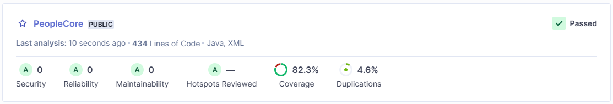

# Contenido

<!-- TOC -->
* [Contenido](#contenido)
* [Información](#información)
* [Dependencias](#dependencias)
* [Estructura](#estructura)
* [Utilización](#utilización)
* [Pruebas](#pruebas)
<!-- TOC -->

# Información

- El servicio se ejecuta en el puerto: **9091** (application.properties)
- Acceder a la consola de [Swagger](http://localhost:9091/swagger.html)
- Acceder al cliente [h2](http://localhost:9091/h2-console) 
- - **user:** sa
- - **password:** qwerty
- - **JDBC URL:** jdbc:h2:mem:core

Se ha utilizado Swagger como cliente de API para realizar pruebas manuales 
con parametros customizables.

Se utiliza un RestControllerAdvice (ApiExceptionHandler) y una excepción 
generica (Exception) a modo de generar una respuesta a las excepciones ocurridas
durante la ejecución, estas son mapeadas a un objeto (StandardizedApiExceptionResponse)
a modo de cumplir con el estandar propuesto por la IETF [RFC 7807](https://datatracker.ietf.org/doc/html/rfc7807)

# Dependencias

Dependencias utilizadas
- JAVA = 19
- MAVEN = 3.8.5
- Spring Boot = 3.4.3

# Estructura

La aplicación sigue una arquitectura hexagonal/clean architecture, adaptada al estilo de Spring Boot:
- **Puertos**: Los repositorios y controladores actúan como puertos de entrada/salida.
- **Adaptadores**: Los controladores (REST) y repositorios (JPA) son adaptadores que conectan el núcleo de la aplicación con el mundo exterior.
- **Dominio**: Las entidades y los servicios forman el núcleo de la lógica de negocio.

He decidido aplicar esta arquitectura ya que es en la cual tengo mejor control, he utilizado arquitectura hexagonal pero nunca iniciando yo la 
arquitectura y estructura, siempre a modo de mantenimiento y desarrollo de nuevas funcionalidades sobre esta. 

```
src
├── main
│   ├── java
│   │   └── com.inditex.peoplecore
│   │       ├── PeopleCoreApplication.java // Clase principal de la aplicación.
│   │       ├── common
│   │       │   └── // Clases comunes del código.
│   │       ├── controller
│   │       │   └── // Controladores para acceder a funcionalidades.
│   │       ├── dto
│   │       │   └── // Clases DTOs.
│   │       ├── exception
│   │       │   └── // Clases para manejar Excepciones.
│   │       ├── mapper
│   │       │   └── // Clases para mapear Entidades a DTOs.
│   │       ├── repository
│   │       │   ├── // Interfaces de repositorios para acceder a entidades.
│   │       ├── entity
│   │       │   ├── // Entidades de base de datos.
│   │       │   └── pk
│   │       │       └── // Clases de llaves primarias compuestas.
│   │       └── service
│   │           └── // Clases para manejar funcionalidades .
│   └── resources
│       ├── application.properties // Archivo de propiedades.
│       └── db
│           ├── // Migraciones de base de datos.
└── test
├── java
│   └── com.inditex.peoplecore
│       └── // Clases de pruebas.
```

# Utilización
- Limpiar el proyecto
```shell
mvn clean
```
- Ejecutar pruebas
```shell
mvn test
```
- Compilar proyecto (incluidos tests) y generar archivo "jar".
```shell
mvn clean package
```

# Pruebas

Se han hecho pruebas utilizando SonarQube
```shell
mvn clean verify sonar:sonar -Dsonar.token=<token> -Dsonar.host.url=<sonar_url> -Dsonar.projectKey=<project_key>
```
